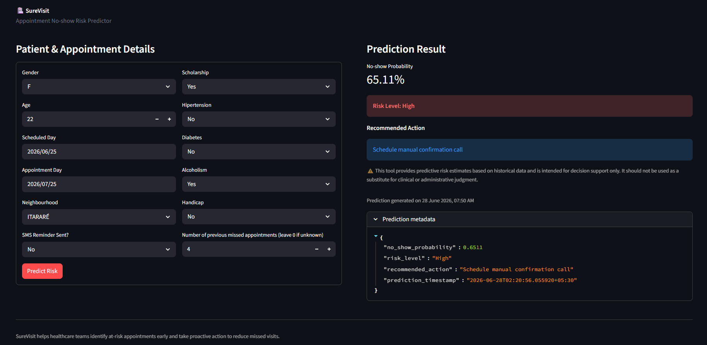
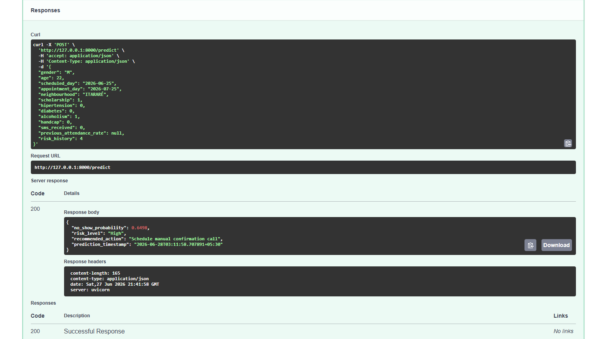

# 🏥 SureVisit

**Healthcare Appointment No-show Prediction & Decision-Support System**

SureVisit predicts the probability that a scheduled patient will miss their appointment, classifies that risk into actionable tiers, and recommends a specific intervention — turning historical appointment data into a proactive scheduling tool for healthcare providers.



---

## 📌 Business Problem

Healthcare providers consistently lose revenue and operational efficiency when patients miss scheduled appointments without cancelling. This results in:

- Lost revenue from unused appointment slots
- Idle doctor and clinical staff time
- Inefficient allocation of limited healthcare resources
- Longer waiting lists for other patients who could have used that slot

Most clinics today identify no-shows only *after* they happen, relying on manual or no intervention at all. SureVisit shifts this from reactive to proactive — flagging at-risk appointments in advance so staff can act (a reminder, a confirmation call) before the patient misses the visit.

---

## 👥 Who Is This For?

- **Hospital Administrators** — allocate staff and resources based on predicted attendance, not assumptions
- **Clinic Scheduling Teams** — know in advance which patients need a reminder call vs. a simple SMS
- **Healthcare Operations Analysts** — understand which factors (waiting time, history, demographics) actually drive no-show behavior, backed by explainable model output

---

## 🛠️ Tech Stack

| Category | Tools |
|---|---|
| Data Processing | Python, Pandas, NumPy |
| Machine Learning | Scikit-learn, XGBoost |
| Explainability | SHAP |
| Visualization | Matplotlib, Seaborn |
| Backend API | FastAPI, Uvicorn |
| Interactive Dashboard | Streamlit |
| Containerization | Docker |
| Testing | Pytest, Pytest-Cov |
| Version Control | Git, GitHub |

---

## 📊 Dataset

- **Source:** [Kaggle — Medical Appointment No Shows](https://www.kaggle.com/datasets/joniarroba/noshowappointments)
- **Size:** ~110,500 appointment records (after cleaning), Brazilian public healthcare system, April–June 2016
- **Target Variable:** `No-show` — `0` (attended) / `1` (missed appointment)

| Original Field | Description |
|---|---|
| `PatientId`, `AppointmentID` | Identifiers (dropped before modeling) |
| `Gender` | Patient gender |
| `ScheduledDay` / `AppointmentDay` | Timestamps used to derive waiting time |
| `Age` | Patient age |
| `Neighbourhood` | One of 81 neighbourhoods in Espírito Santo, Brazil |
| `Scholarship` | Whether patient is enrolled in Brazil's welfare program |
| `Hipertension`, `Diabetes`, `Alcoholism`, `Handcap` | Chronic condition / disability flags |
| `SMS_received` | Whether a reminder SMS was sent |

### Data Quality Issues Found & Fixed
- 1 record with `Age = -1` (invalid) — removed
- 5 records with negative waiting days (appointment before scheduling — a data entry error) — removed
- `Handcap` originally ranged 0–4 (severity levels) with only ~0.18% of records above 0 — converted to a binary flag, since the higher severity levels had too few samples to be statistically meaningful
- 28 of 81 neighbourhood names contained Portuguese accented characters (e.g. `ITARARÉ`, `SÃO JOSÉ`) — normalized to plain-English equivalents (`ITARARE`, `SAO JOSE`) so API consumers and dashboard users get consistent predictions regardless of how they enter the value

---

## 🧪 Feature Engineering

The dataset alone doesn't capture *why* a patient might miss an appointment — the following features were engineered to make the model decision-relevant rather than just descriptive:

| Feature | How It's Computed | Why It Matters |
|---|---|---|
| `WaitingDays` | Appointment date − scheduled date (date-only) | Longer gaps between booking and visit correlate strongly with no-shows |
| `AppointmentWeekday` / `AppointmentMonth` | Extracted from appointment date | Captures weekly/seasonal attendance patterns |
| `AgeGroup` | Binned age (Child, Teen, Young Adult, Adult, Senior) | Attendance behavior varies by life stage |
| `ChronicDiseaseCount` | Sum of Hipertension + Diabetes + Alcoholism flags | Patients managing chronic conditions may have different attendance patterns |
| `Neighbourhood_Freq` | Frequency-encoded neighbourhood (appointment count) | Avoids an 81-column one-hot explosion while still capturing location signal |
| `PreviousAttendanceRate` | Patient's historical no-show rate, computed as an **expanding mean using only prior appointments** (no data leakage), with the population average as a fallback for first-time patients | The single strongest predictor of future no-show risk in most no-show literature |
| `RiskHistory` | Cumulative count of a patient's past no-shows (expanding sum, prior-only) | Distinguishes "missed once" from "habitual no-show" |
| `ReminderEffectivenessScore` | `SMS_received × (1 − PreviousAttendanceRate)` | Captures the interaction between reminders and a patient's underlying reliability — a reminder matters more for an unreliable patient |

**Note on leakage prevention:** `PreviousAttendanceRate` and `RiskHistory` are computed using only appointments that occurred *before* the current one for each patient (via a chronologically sorted, shifted expanding window). This was deliberate — a naive groupby-mean across all of a patient's appointments would leak future outcomes into past predictions.

---

## 🤖 Model Comparison

Four models were trained and evaluated on the same engineered feature set, with class imbalance (~80% attended / ~20% no-show) handled via `class_weight='balanced'` (or `scale_pos_weight` for XGBoost):

| Model | Accuracy | Recall (No-show) | Precision (No-show) | F1 (No-show) | ROC-AUC |
|---|---|---|---|---|---|
| Logistic Regression | 0.65 | 0.60 | 0.31 | 0.41 | 0.679 |
| Decision Tree | 0.59 | 0.83 | 0.31 | 0.45 | 0.734 |
| **Random Forest** | **0.61** | **0.80** | **0.32** | **0.45** | **0.740** |
| XGBoost | 0.65 | 0.71 | 0.33 | 0.45 | 0.736 |

Evaluation included confusion matrices and ROC curves for all four models (see `notebooks/03_model_training.ipynb`), in addition to the classification metrics above.

### Why Accuracy Alone Is Misleading Here
The dataset is ~80% "attended," so a model that always predicts "will attend" scores ~80% accuracy while being completely useless. **Recall on the no-show class is the metric that matters operationally** — missing a true no-show costs more (an empty slot, a wasted doctor-hour) than a false alarm (an extra reminder SMS).

### Final Model: Random Forest
Selected because it had the **highest ROC-AUC (0.740)** — the most reliable threshold-independent measure of discriminative power — while maintaining strong recall (0.80) for the no-show class. It's also tree-based, which made SHAP explainability fast and clean to integrate (`TreeExplainer`).

**Stability check:** 5-fold cross-validation confirmed this wasn't a lucky train-test split — mean ROC-AUC of **0.7425** (std dev **0.0011**) closely matched the single-split result.

### Key Findings — Feature Importance & SHAP
Both the model's built-in `feature_importances_` and the SHAP analysis agree on the top feature: **`WaitingDays`** (the gap between scheduling and appointment date) dominates, accounting for **61% of total feature importance** — far ahead of the next-ranked features (`Age` and `PreviousAttendanceRate`, ~6.4% each). This is consistent with healthcare scheduling research: the longer the gap between booking and the actual visit, the more likely a patient's circumstances change before the appointment.

This concentration on a single feature was a deliberate point of scrutiny rather than an assumption — `RiskHistory`, despite being intuitively important, ranked comparatively low (~3.8%). Investigation showed this was due to its highly skewed distribution in the training data (the median patient has zero prior no-shows), giving the model limited variation to learn from for that specific feature. This was verified by holding `RiskHistory` constant and varying `WaitingDays`/`PreviousAttendanceRate`/`SMS_received` instead, which produced a >30-point swing in predicted probability — confirming the model's overall sensitivity is sound, even where one specific feature underperforms intuition.

---

## 🎯 Risk Categorization & Recommendations

Model probabilities are converted into three actionable tiers (thresholds are configurable in `app/predictor.py`):

| Probability | Risk Level | Recommended Action |
|---|---|---|
| 0% – 30% | 🟢 Low | Standard workflow, no action needed |
| 31% – 60% | 🟡 Medium | Send additional SMS reminder |
| 61% – 100% | 🔴 High | Schedule a manual confirmation call |

---

## 💡 Why This Project Is Different

This project uses the well-known Kaggle "Medical Appointment No Shows" dataset, on which thousands of public notebooks already exist. The differentiation here isn't the dataset — it's what's built on top of it:

- **Leakage-safe historical features** (`PreviousAttendanceRate`, `RiskHistory`) computed with proper chronological ordering, not a naive groupby that most public notebooks on this dataset use
- **A full decision-support layer** (risk tiering + recommended action), not just a probability output
- **SHAP-based explainability** wired into both the training pipeline and verified at the individual-prediction level
- **A production-shaped system**: a FastAPI service with Pydantic validation, a reusable feature-engineering module shared between training and serving (avoiding train-serve skew), pytest coverage at 96%, and a containerized deployment available on Docker Hub — rather than a single analysis notebook

---

## 📁 Project Structure

```bash
surevisit/
│
├── app/
│   ├── __init__.py
│   ├── main.py
│   ├── predictor.py
│   ├── features.py
│   └── schemas.py
│
├── dashboard/
│   └── streamlit_app.py
│
├── data/
│   ├── raw/
│   └── processed/
│       ├── X_train.csv
│       ├── X_test.csv
│       ├── y_train.csv
│       └── y_test.csv
│
├── examples/
│   └── sample_request.json
│
├── models/
│   ├── final_pipeline.joblib
│   ├── neighbourhood_freq.joblib
│   └── feature_columns.joblib
│
├── notebooks/
│   ├── 01_eda.ipynb
│   ├── 02_preprocessing.ipynb
│   └── 03_model_training.ipynb
│
├── screenshots/
│   ├── dashboard.png
│   └── api_docs.png
│
├── tests/
│   ├── __init__.py
│   ├── test_health.py
│   └── test_predict.py
│
├── .dockerignore
├── .gitignore
├── conftest.py
├── Dockerfile
├── requirements.txt
└── README.md
```

---

## 🚀 Getting Started

### Option 1 — Local Setup

**1. Clone the repository**
```bash
git clone https://github.com/md-faiyazkhan/surevisit.git
cd surevisit
```

**2. Create a virtual environment and install dependencies**
```bash
python -m venv .venv
.venv\Scripts\activate        # Windows
pip install -r requirements.txt
```

**3. Download the dataset**

Download `KaggleV2-May-2016.csv` from [Kaggle](https://www.kaggle.com/datasets/joniarroba/noshowappointments) and place it in `data/raw/`.

**4. Run the notebooks in order**
notebooks/01_eda.ipynb

notebooks/02_preprocessing.ipynb

notebooks/03_model_training.ipynb
This generates the processed data splits and the model artifacts in `models/`.

**5. Run the FastAPI service**
```bash
uvicorn app.main:app --reload
```
API docs available at `http://127.0.0.1:8000/docs`

**6. Run the Streamlit dashboard**
```bash
streamlit run dashboard/streamlit_app.py
```
Dashboard available at `http://localhost:8501`

---

### Option 2 — Docker

**Pull from Docker Hub (recommended — no build required)**
```bash
docker pull mdfaiyazkhan/surevisit:latest
docker run -p 8000:8000 -p 8501:8501 mdfaiyazkhan/surevisit:latest
```

**Or build locally from source**
```bash
docker build -t mdfaiyazkhan/surevisit:latest .
docker run -p 8000:8000 -p 8501:8501 mdfaiyazkhan/surevisit:latest
```

**Access**
- FastAPI Docs: `http://localhost:8000/docs`
- Streamlit Dashboard: `http://localhost:8501`

Image also available on [Docker Hub](https://hub.docker.com/r/mdfaiyazkhan/surevisit).

---

## 📡 API Reference

**Base URL:** `http://localhost:8000`



**Health Check**
GET /
```json
{
  "status": "healthy",
  "model": "loaded"
}
```

**Prediction**
POST /predict

**Sample Request** (see also `examples/sample_request.json`):
```json
{
  "gender": "F",
  "age": 45,
  "scheduled_day": "2024-05-10",
  "appointment_day": "2024-05-15",
  "neighbourhood": "JARDIM DA PENHA",
  "scholarship": 0,
  "hipertension": 1,
  "diabetes": 0,
  "alcoholism": 0,
  "handcap": 0,
  "sms_received": 1,
  "previous_attendance_rate": null,
  "risk_history": null
}
```

**Sample Response:**
```json
{
  "no_show_probability": 0.5383,
  "risk_level": "Medium",
  "recommended_action": "Send additional SMS reminder",
  "prediction_timestamp": "2026-06-20T19:36:51.314675"
}
```

> `previous_attendance_rate` and `risk_history` are optional. If omitted (e.g. for a first-time patient), the system falls back to the population-average no-show rate and zero respectively — the same logic used during training for patients without prior history.

> **Note on `neighbourhood`:** values are matched against a frequency map built from the (accent-normalized) training data. Enter neighbourhood names using plain English characters (e.g. `ITARARE`, not `ITARARÉ`) for an exact match. The Streamlit dashboard avoids this entirely via a dropdown populated directly from the training data.

---

## 🖥️ Dashboard

The Streamlit dashboard provides a form-based interface over the same prediction logic used by the API (no duplicate code — it imports directly from `app/predictor.py`), so administrative staff without API knowledge can use the tool. It includes a clear human-readable timestamp, color-coded risk levels, a neighbourhood dropdown populated from the training data, and an explicit disclaimer on every prediction.

---

## 🧪 Testing

```bash
pytest tests/ --cov=app --cov-report=term-missing
```

**Result: 5 tests passing, 96% code coverage**, covering the health endpoint, valid predictions, high-risk classification, and input validation (invalid age, missing required fields).

---

## 🔮 Future Improvements

- **Overbooking optimization** — use no-show probabilities to recommend how many extra slots a clinic could safely overbook per time slot, minimizing both idle slots and overcrowding risk
- **Automated reminder integration** — connect the recommendation output to an actual SMS/WhatsApp gateway instead of a manual action label
- **Model monitoring** — track prediction drift over time as new appointment data comes in
- **Database-backed patient history** — replace the optional manual `risk_history` input with a live lookup against an appointments database
- **AWS deployment** — containerized deployment to EC2 with S3-backed model artifact storage

---

## ⚠️ Disclaimer

SureVisit is a portfolio/demonstration project. It is a predictive model trained on a single historical, geographically specific dataset (Brazilian public healthcare appointments, a 3-month window in 2016) and is intended **only as a decision-support aid**, not as a clinical or operational decision-maker. Predictions reflect patterns learned from this specific dataset and may not generalize to other healthcare systems, patient populations, or time periods. Always apply human judgment when acting on these predictions.

---

## 👤 Author

**Md Faiyaz Khan**
- GitHub: [@md-faiyazkhan](https://github.com/md-faiyazkhan)
- LinkedIn: [@mdfaiyazkhan](https://www.linkedin.com/in/mdfaiyazkhan)
- Email: faiyazkhan.work@gmail.com